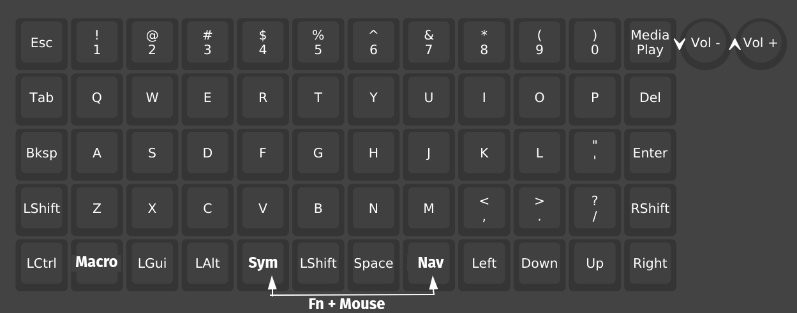
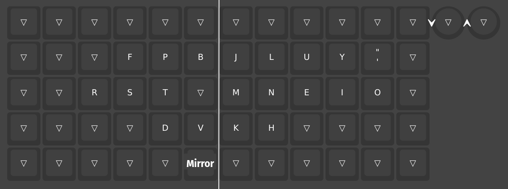
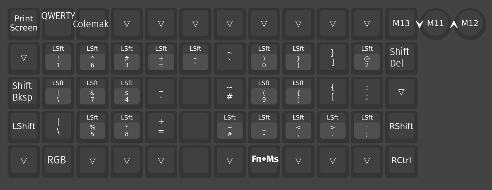
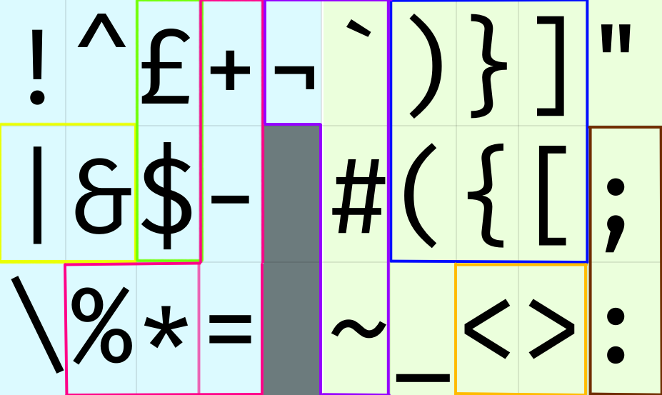
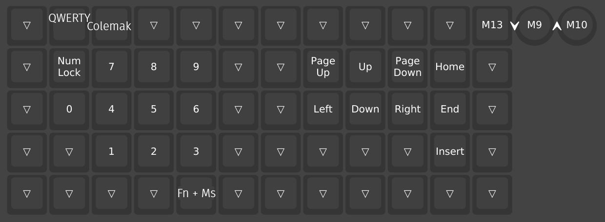
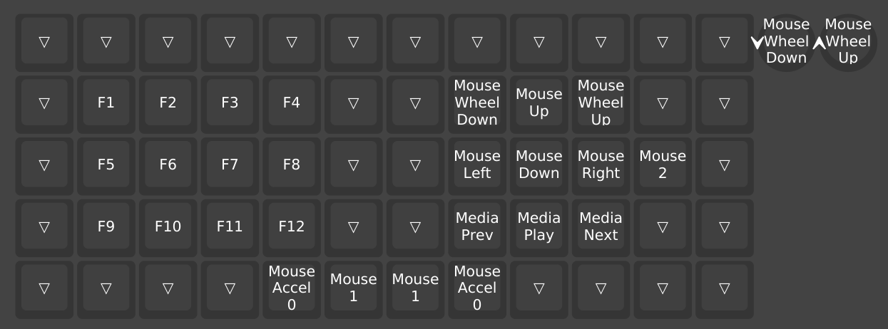
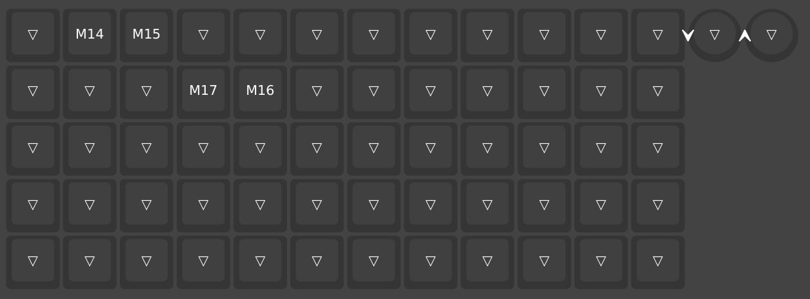
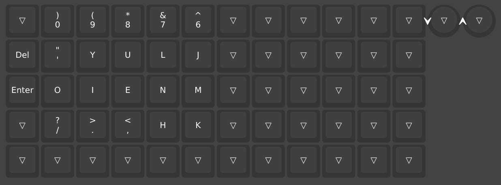
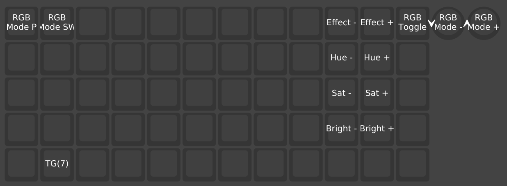

# P60-vial
Vial configs for my 60 key ortholinear keyboard.

## I'm now mostly using a ZSA Voyager

[My Voyager Layout](https://configure.zsa.io/voyager/layouts/eVlgx/latest) is heavily inspired by the following documentation. But with some pretty major tweaks. There are some things the Oryx configurator can't do that Vial allows and vice-versa. Still, having a lot of fun with both of these keyboards :).

## What I want from my layout

- Toggle between qwerty and colemak-dh
- Backspace without fully rearranging hands
- Symbols in familiar or at least logical places
- Arrow keys available for moving windows / chunks of code around
  - Generally, arrow keys available with and without layer switching
- Numpad layer
- Right hand thumb for space
- Avoid complex chords
- Avoid tap actions which block a key being registered
- Simplify wherever possible

## Current files

- Main
  - The setup I'm actually using and have active muscle memory for.

- Callum Oakley
  - An attempt at moulding [the Callum Oakley layout](https://github.com/callum-oakley/keymap) to my preferences.
  - This helped to inspire some of my main layout

- Init
  - The initial setup of my board with some tweaks for my own sanity. An easy template to try new things from.

- Miryoku
  - An attempt at moulding [the Miryoku layout](https://github.com/manna-harbour/miryoku/tree/master/docs/reference) to my own preferences / OLKB matrix.

- Wide no left col
  - Loses both left and right column of modifiers (including esc, left shift, enter) in favour of more space for symbols.

- Artsey
  - An attempt at [the artsey layout](https://artsey.io). Adds a layer switch to get to the artsey layers and fills the entire combos memory with artsey key combos. Clearly not what vial / this keyboard was intended for.

## References

- [The Callum Oakley layout](https://github.com/callum-oakley/keymap)
- [The Miryoku layout](https://github.com/manna-harbour/miryoku/tree/master/docs/reference)
- [A guide to home row mods](https://precondition.github.io/home-row-mods)
- [Keymap DB](https://keymapdb.com/)

## Main Layout

This is an ongoing process... So the below is likely to be a bit out of date.
Commits to this repo will show what I'm experimenting with at the moment.

### Layer 0 - QWERTY + Standard Mods

- Esc in top left
- ISO number row
- Rotary encoder - Basic media controls
- Central
  - QWERTY ISO keys (I'm from the UK)
- Left col
  - Backspace replaces caps lock positioning
- Right col
  - Delete replaces backspace positioning on right
- Bottom row
  - Macro layer switch snuck between CTRL + LGUI
  - Outer thumb keys for main layer switches
    - Left Outer = Symbols layer
    - Right Outer = Navigation (arrows) + numbers
    - Tri Layer = Functions + mouse control
  - Experimenting with LShift for left thumb inner key (so far unsuccessfully)
  - Space on right thumb only
  - Arrow cluster (rarely used, but convenient for mod combos)

### Layer 1 - Colemak

- Colemak-DH angle mod
- Only overrides colemak characters not present in QWERTY
- Uses `'` instead of `;` for typing convenience
- Experimental mirror mode layer on left thumb inner, to allow for one-hand only typing.
  - Line to denote axis of mirroring + to help understand hand positioning

### Layer 2 - Symbols

- Print screen is easily accessed
- Dedicated base layer toggles for Qwerty + Colemak
- Tri layer switch for functions + mouse
- Rotary encoder set to execute macros to press MEH combinations related to audio
  - Press = Reset audio balance
  - Anticlockwise = Reduce left audio balance
  - Clockwise = Increase left audio balance

It's super hard to read the symbols map in the middle particularly given the ISO formatting, so here's the full thing annotated:

- Left Hand:
  - `!` - Close to original position in shifted number row
  - `^` - Lesser used position for lesser used char
  - `£` - UK symbol, positioned above frequently used `$` - **cash cluster**
  - `+` - Forms the **calculation cluster** `+-=` - upper key for addition helped memorisation
  - `¬` - Least used symbol in least convenient location - weirdest of the **weirdos cluster**
  - `|` - Homerow - OR operator - **combinator cluster** with `&`
  - `&` - Homerow - AND operator - **combinator cluster** with `|`
  - `$` - Homerow - It's frequently used in PHP development - **cash cluster**
  - `-` - Homerow -  Part of the **calculation cluster**, `-` is lower than `+`
    - Frequently used as `->` in php dev
  - `\` - Similar location to QWERTY ISO `\` key
  - `%` - Part of secondary **calculation cluster**
  - `*` - Part of secondary **calculation cluster**
  - `=` - Part of the **calculation cluster**
    - I'm debating a way to make `!=` a more comfortable movement...
    - Frequently used as `=>` in php dev

- Right Hand:
  - `\`` - Only somewhat frequently used - part of the **weirdos cluster**
  - `)}]` - Closing **bracket cluster**
    - Debating rearranging to allow easier open-close movements `()`...
  - `"` - Same positioning as shifted base layer `'`
  - `#` - Only somewhat frequently used - part of the **weirdos cluster**
  - `({[` - Opeing **bracket cluster** - very frequently used.
    - Organised in terms of typical usage: E.g. `() => { return [] }`.
  - `;` - Frequently used - Position is close to that of a fullsize qwerty layout kb - part of **colon cluster** (teehee)
  - `~` - Part of the **weirdos cluster**
  - `_` - Somewhat frequently used - position is near spacebar *shrug*
  - `<>` - **carrot cluster**
  - `:` - Part of **colon cluster**

### Layer 3 - Number + Navigation

- Dedicated base layer toggles for Qwerty + Colemak
- Numpad on left hand
- Arrow cluster on right hand
- Page up + down close by
- Home, end + insert in pinky column
- Tri layer switch for functions + mouse
- Rotary encoder set to execute macros to press MEH combinations related to audio
  - Press = Reset audio balance
  - Anticlockwise = Reduce right audio balance
  - Clockwise = Increase right audio balance
  
**This is a little out of date - but still mostly correct**

I've added tapdance to superimpose the function layer keys onto the numpad. The function keys also increase from the bottom left to top right.

### Layer 4 - Functions + Mouse

- Left hand - Functions laid out in 4*3 grid - seems like the easiest single handed key model to visualise
  - Image is outdated - functions actually increase from bottom to top
- Right hand - Mouse movements in the same positions as nav cluster on layer 3
- Media keys in the lower row
- Left + right click spread across unused thumb + pinky finger
- Accelleration keys can be held with unused thumb
- From base layer, holding right thumb then left thumb, you can then release right thumb and use it freely. The same is true with directions switched, but right then left is more useful.
- Mouse wheel also available on rotary encoder

### Layer 5 - Macros

- M14 = Bluetooth settings
- ~~M15 = Gui + "spotify"~~
- M17 - Sits on the `F` key of the colemak layer
  - Types `protected $fillable = [];`, and positions the cursor to define fillable attributes
- M16 - Sits on the `P` key of the colemak layer
  - Types `public function (){}`, and positions the cursor to define the function name

### Layer 6 - Experimental Mirror Mode

- Is right hand of the Colemak layer - mirrored for the left hand to use
- Image is outdated, this now also supports right hand only typing.

### Layer 7 - RGB

- Specifically blocks lower layers to allow to test key effects
- Layer toggle in the bottom row deactivates the layer
- Rotary encoder to switch through effects
